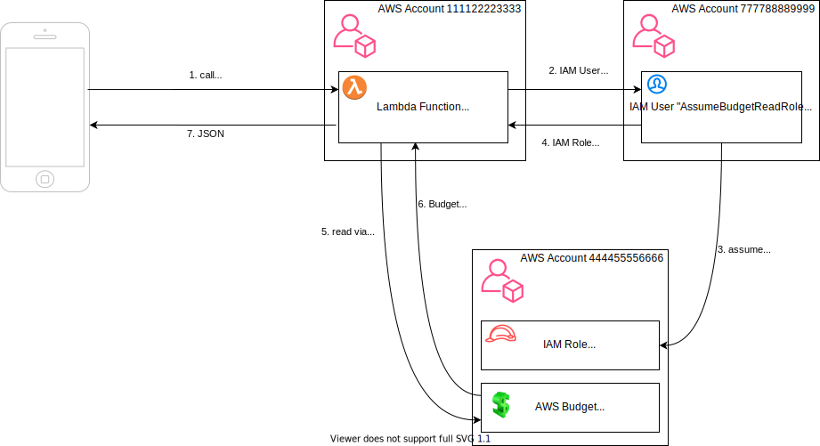

# awsbudget

Dies ist eine AWS-Lambda-Funktion, die die essentiellen Daten von AWS Budgets als JSON liefert. Sie kann bspw. als Backend für iOS Scriptable Widgets genutzt werden.

## Installation

Die `serverless.yml` zum Deployment per Serverless Framework ist inkludiert.

## Aufruf

Die Lambda kann per API-Gateway-Endpunkt aufgerufen werden, also bpsw. `https://<api_gateway_id>.execute-api.eu-central-1.amazonaws.com/prod/budget/<aws_account_id>/<budget_name>`.

Die Autorisierung erfolgt über einen IAM User und eine IAM Role. Die IAM Role muss die Berechtigung haben, das AWS Budget im übergebenen AWS Account zu lesen. Der IAM User muss die Berechtigung haben, diese IAM Role zu assumen. Folgende 3 Header müssen beim Funktionsaufruf mitgegeben werden:
    - aws_role_name
    - aws_access_key_id
    - aws_secret_access_key
    
## Caching

Das API Gateway cached Aufrufe für 1h. Cache-Keys sind alle übergebenen Parameter. Das soll verhindern, dass ein unberechtigter Aufruf (ohne übergebenen IAM User) ein gecachetes Ergebnis erhält.

Caching ist auf jeden Fall sinnvoll, da die AWS Cost Explorer API Kosten von USD 0.01 pro Aufruf verursacht.
